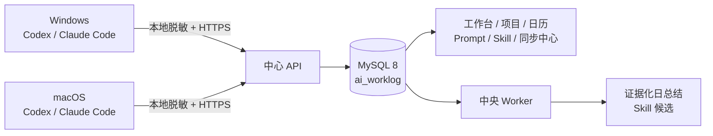

# AI 工作沉淀台

一个面向个人的跨设备 AI 工作记录工具。Windows 和 macOS 各自只读采集 Codex / Claude Code 记录，在本地脱敏后通过 HTTPS 上传到同一个中心服务，再按 Git Remote 归并项目，生成日历、工作总结和 Skill 候选。



## 已实现

- Codex 与 Claude Code JSONL 连接器，包含 Windows / macOS fixture 回归测试。
- SQLite Outbox、每批最多 200 事件且不超过 2 MiB、ACK 后确认、超时后安全重传。
- 设备独立 Token HMAC 鉴权、请求摘要、幂等批次与事件版本。
- MySQL 8 迁移、UTC `DATETIME(6)`、`utf8mb4`、ngram 中文全文索引。
- 两台设备通过规范化 Git Remote 归并到同一项目。
- 中央 Worker 根据已持久化的同步批次刷新证据化日总结；设备未到齐时标记 `partial`。
- 迟到数据生成新 Revision；人工编辑后不会被静默覆盖。
- 基于重复证据生成 Skill 候选，不会自动写入或发布 Skill。
- Gmail / Material 风格的 7 个页面，支持 1440 / 1280 / 1024 宽度。

## 环境要求

- Node.js 22+
- npm 10+
- MySQL 8.0+（不支持 MariaDB）
- 生产环境的 HTTPS 域名或可信反向代理

## 快速启动

```bash
npm install
cp .env.example .env.local
# 先编辑 .env.local：填写可连接 MySQL 的管理员账户，
# 并把所有 replace-with-* 换成随机值。两枚设备 Token 必须不同且至少 32 字符。
npm run db:bootstrap
npm run db:seed
npm run dev
```

打开 `http://127.0.0.1:3000`。构建与生产启动：

```bash
npm run build
npm run start -w @ai-worklog/web
```

`.env.local` 已被 Git 忽略。不要把 MySQL 密码、设备 Token、Token Pepper 或工作台密码写入源码。
可用 `openssl rand -hex 32` 生成 Pepper/Token；Windows PowerShell 可执行 `$b = New-Object byte[] 32; [Security.Cryptography.RandomNumberGenerator]::Fill($b); [Convert]::ToHexString($b)`。首次初始化顺序是：管理员账户建库/迁移/种子数据 → 创建低权限应用账户 → 切换 Web/Worker 运行凭证。

### MySQL 权限

迁移需要管理员账户。平时运行 Web / Worker 只需要 `ai_worklog` 库的 `SELECT, INSERT, UPDATE, DELETE`。可以在管理员凭证仍位于 `.env.local` 时执行：

```bash
APP_DB_USER=ai_worklog_app \
APP_DB_PASSWORD='<long-random-password>' \
node scripts/create-mysql-app-user.mjs
```

创建完成后，把 `.env.local` 的 `MYSQL_USER` / `MYSQL_PASSWORD` 切换为应用账户。不要在生产环境使用 `root`。

生产默认要求 `MYSQL_SSL=true`。如果 MySQL 仅位于可信私网或加密隧道中且暂未启用 TLS，需显式设置 `ALLOW_INSECURE_MYSQL=true`；这是风险确认开关，不会把私网连接变成加密连接。

## Windows 和 Mac 如何汇总

两台机器不共享 SQLite 或直连 MySQL。它们只需要使用：

- 相同的 `AI_WORKLOG_ACCOUNT_ID`；
- 各自不同的 `AI_WORKLOG_DEVICE_ID` 和 `AI_WORKLOG_DEVICE_TOKEN`；
- 相同的 HTTPS `AI_WORKLOG_SYNC_URL`；
- 每个工具/安装独立且稳定的 `SOURCE_INSTANCE_ID`。

`AI_WORKLOG_DEVICE_ID` 必须与该 Token 在中心端绑定的设备 ID 完全一致。`db:seed` 使用 `.env.local` 中的 `MACOS_DEVICE_ID` / `WINDOWS_DEVICE_ID` 建立绑定；默认分别是 `device_macos_demo` / `device_windows_demo`。Mac 使用 `MACOS_DEVICE_TOKEN`，Windows 使用 `WINDOWS_DEVICE_TOKEN`。

项目主键优先来自去凭证后的 Git Remote。例如，Windows 的 `git@github.com:acme/worklog.git` 与 Mac 的 `https://github.com/acme/worklog.git` 会归并为 `github.com/acme/worklog`。
真实日志没有 Git Remote 字段时，采集器会在设备本地用无 shell 的只读 Git 命令解析 `origin`，去除 URL 凭证后再上传规范化 Remote。无 Remote 时保守使用 Git Root/工作路径 HMAC 隔离，目录名只用于展示。

### 设备端配置

每台机器使用独立配置文件，权限仅限当前用户：

```dotenv
AI_WORKLOG_ACCOUNT_ID=account_demo
AI_WORKLOG_DEVICE_ID=device_macos_demo
AI_WORKLOG_DEVICE_TOKEN=<this-device-token>
AI_WORKLOG_SYNC_URL=https://worklog.example.com/api/v1/sync/batches
AI_WORKLOG_PATH_HMAC_KEY=<random-per-device-key>
COLLECTOR_DB_PATH=/Users/me/.ai-worklog/collector.sqlite

CODEX_SOURCE_INSTANCE_ID=codex-mac-main
CODEX_SOURCE_PATH=/Users/me/.codex/sessions
CLAUDE_CODE_SOURCE_INSTANCE_ID=claude-mac-main
CLAUDE_CODE_SOURCE_PATH=/Users/me/.claude/projects
```

Windows 将路径改为 `%USERPROFILE%\\.codex\\sessions`、`%USERPROFILE%\\.claude\\projects` 和 `%USERPROFILE%\\.ai-worklog\\collector.sqlite`。

手动执行两个连接器：

```bash
AI_WORKLOG_SOURCE_TYPE=CODEX npm run collector -- prepare
AI_WORKLOG_SOURCE_TYPE=CLAUDE_CODE npm run collector -- prepare
npm run collector -- sync
npm run collector -- status
```

采集器对非 localhost 地址强制 HTTPS。请不要把设备 Token 放进命令行参数、任务调度器参数或 Git。

## 每晚自动同步

macOS launchd 与 Windows Task Scheduler 安装/卸载脚本见 [README_SCHEDULES.md](./README_SCHEDULES.md)。默认每晚 23:30 运行，密钥只从设备本地的受限配置文件读取。

同步 API 收到 ACK 前，Outbox 不会删除待传数据。断网、进程退出或“数据库已提交但 ACK 丢失”后，下次会安全重传。

## 总结 Worker

同步 HTTP 请求只负责事务提交并立即 ACK，不在请求线程生成总结。发生新增或变更时，同步事务会按账户时区把工作日期登记到持久化 `summary_jobs`；中央 Worker 读取全部待总结日期并利用输入指纹幂等补算：

```bash
npm run worker -- 2026-07-14
```

不传日期时同时包含账户时区中的当天。输入指纹未变化时不生成重复 Revision。任务仅在成功刷新后按 generation 条件清除；若刷新期间又有新同步、Worker 崩溃或处理失败，任务会保留给下次重试。在中央服务的调度器/进程守护中将 `npm run worker` 安排在设备同步之后（例如每晚 23:40）。

## API

- `POST /api/v1/sync/batches`：设备 Bearer Token 鉴权的同步接口。
- `GET /api/v1/dashboard`
- `GET /api/v1/projects`
- `GET /api/v1/prompts`
- `GET /api/v1/calendar?month=YYYY-MM`
- `GET /api/v1/skills`
- `GET /api/v1/sync`
- `GET /api/v1/privacy`

生产环境中，页面和读 API 使用 `DASHBOARD_USERNAME` / `DASHBOARD_PASSWORD` 的 Basic Auth，并必须置于 HTTPS 之后。同步接口不使用工作台密码，而使用每台设备的独立 Token。

## 安全边界

- 原始 Prompt 默认留在本机，中心仅保存脱敏后的可搜索内容。
- 中心需要做搜索与总结，因此这不是“服务器看不到明文”的零知识系统。
- 历史 Prompt、助手结果和 Skill 全部作为不可信数据，不执行其中的命令、链接或工具调用。
- 中心服务会二次检查内容摘要、脱敏状态与 metadata 白名单。
- 日志只记录 ID、计数和错误码，不记录 Prompt、Token 或 Git Remote。
- 应用内含鉴权前熔断与有界 MySQL 等待队列；公网部署仍必须在可信反向代理上对 `/api/v1/sync/batches` 按来源 IP 限流。

## 验证

```bash
npm test
npm run typecheck
npm run lint
npm run build
```

真实 Chrome 视口验证脚本位于 `scripts/browser-smoke.mjs`，通过 Chrome DevTools Protocol 检查页面例外、网络失败、交互元素可访问名称并生成截图。

## MVP 边界

- 当前是单用户/单账户版，不是团队权限或员工监控系统。
- Skill 采纳、覆盖和回滚写 API 仍保持禁用；候选只用于人工审核。
- 导出/彻底删除 mutation 尚未开放，界面不会伪造成功反馈。
- 生产部署需配置 HTTPS、MySQL 备份/静态加密与保留策略。
- 本地仓库没有 Git Remote 时，MVP 不会仅凭同名目录自动合并 Windows/Mac 项目，以避免误合并。
